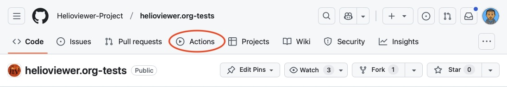
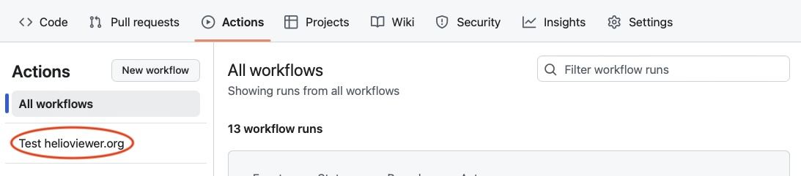

# Playwright Tests for Helioviewer.org

This repository contains playwright tests for [helioviewer.org](https://github.com/helioviewer-Project/helioviewer.org).

The main branch of tests run automatically when a pull request is made to
helioviewer.org, or the Helioviewer API repository. This is done through a
workflow trigger when a pull request is made in one of those repositories.

At this time, tests must be triggered manually.
Github doesn't allow triggering a workflow in a separate repository from a pull request.
We would need to implement a custom solution to make this work.

### Choosing Branches

Sometimes a change requires updating other repositories.
An update to helioviewer.org may depend on an update to the API.
You can manually dispatch tests to run on selected branches using github's
workflow dispatch feature. Follow these steps:

1. Go to actions

2. Select the test workflow

3. Enter the pull request numbers to test against. If left blank, then main
will be used by default.

